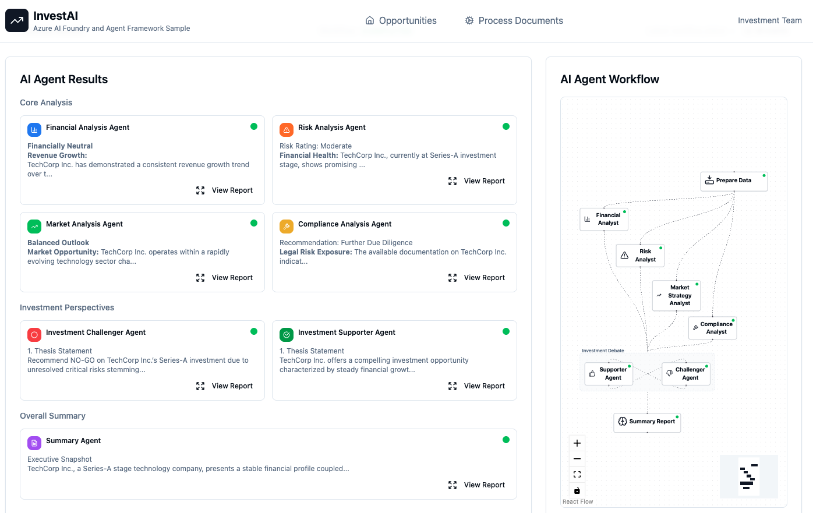

# Agentic AI Investment Analysis Sample

An advanced AI-powered investment analysis platform that leverages multi-agent workflows to perform comprehensive analysis of investment opportunities. This sample application demonstrates how to build sophisticated agentic AI systems using the Microsoft Agent Framework, Azure services, and modern web technologies.

<p align="center">
    <picture>
    
    </picture>
</p>

## 📋 Overview

This application provides an intelligent system for analyzing investment opportunities through automated document processing, multi-agent analysis workflows, and interactive "what-if" scenario planning. The system orchestrates specialized AI agents that collaborate to provide comprehensive investment insights from multiple perspectives: financial, risk, market, and compliance.

## ✨ Key Features

- **Multi-Agent Investment Analysis**: Orchestrates specialized AI agents (Financial Analyst, Risk Analyst, Market Analyst, Compliance Analyst) that work together to provide comprehensive investment analysis
- **Document Intelligence**: Automated processing and analysis of investment documents (financial statements, pitch decks, market research, etc.)
- **Real-Time Streaming**: Server-Sent Events (SSE) architecture for live streaming of agent progress and analysis results
- **Interactive What-If Scenarios**: Chat-based interface for exploring hypothetical scenarios and getting instant analysis
- **Workflow Visualization**: Visual representation of agent workflows and their execution status
- **Investment Opportunity Management**: Full CRUD operations for managing investment opportunities and their associated documents

## 🏗️ Architecture

### Main Components

#### 1. **Backend API (`api-app/`)**

A FastAPI-based REST API that serves as the orchestration layer for the AI agents and data management.

**Core Technologies:**
- **FastAPI**: Modern, high-performance web framework
- **Microsoft Agent Framework**: Powers the multi-agent workflow orchestration
- **Azure Cosmos DB**: NoSQL database for storing opportunities, analyses, and documents
- **Azure Blob Storage**: Document storage and retrieval
- **Azure OpenAI**: LLM provider for AI agent capabilities

**Key Modules:**

- **Workflow System** (`app/workflow/`):
  - `investment_workflow.py`: Main investment analysis workflow orchestrating multiple specialized agents
  - `investment_executors.py`: Individual agent implementations (Financial, Risk, Market, Compliance analysts)
  - `prompts/`: Agent-specific prompt templates for consistent analysis

- **What-If Chat System** (`app/what_if_chat/`):
  - `what_if_workflow.py`: Interactive chat workflow for scenario exploration
  - `what_if_executors.py`: Specialized agents for handling hypothetical scenarios

- **Services** (`app/services/`):
  - `analysis_workflow_executor_service.py`: Manages workflow execution and event streaming
  - `document_processing_service.py`: Handles multi-stage document processing
  - `analysis_service.py`: CRUD operations for investment analyses
  - `opportunity_service.py`: Management of investment opportunities

- **API Routers** (`app/routers/`):
  - `analysis.py`: Endpoints for starting/monitoring analyses with SSE streaming
  - `chat.py`: Interactive chat interface for what-if scenarios
  - `opportunity.py`: Investment opportunity management endpoints

- **Data Models** (`app/models/`):
  - Pydantic models for type-safe data handling
  - Document, Opportunity, Analysis, User models

#### 2. **Frontend Web Application (`web-app/`)**

A modern React-based single-page application providing an intuitive user interface.

**Core Technologies:**
- **React 18** with TypeScript
- **Vite**: Fast build tool and dev server
- **Shadcn/ui**: Beautiful, accessible UI component library
- **Tailwind CSS**: Utility-first CSS framework
- **Lucide React**: Icon library

**Key Features:**
- Dashboard for managing investment opportunities
- Document upload and processing interface
- Real-time analysis progress visualization with agent workflow diagrams
- Interactive chat interface for what-if scenarios
- Responsive design for desktop and mobile

**Main Pages:**
- `Index.tsx`: Landing page with feature showcase
- `NewOpportunity.tsx` / `EditOpportunity.tsx`: Opportunity management
- `ProcessDocuments.tsx`: Document upload and processing
- `Analysis.tsx`: Analysis execution and visualization

#### 3. **AI Agent Workflow**

The system uses a sophisticated multi-agent architecture:

**Investment Analysis Workflow:**
```
Data Preparation → [Financial Analyst, Risk Analyst, Market Analyst, Compliance Analyst] 
→ Analysis Aggregator → Investment Debate Executor → Summary Report Generator
```

Each agent:
- Has specialized knowledge and analysis focus
- Receives contextual prompts from prompt templates
- Processes in parallel where possible (fan-out pattern)
- Results are aggregated and synthesized
- Agents engage in a debate to challenge assumptions
- Final summary report is generated

**What-If Chat Workflow:**
```
Planning Agent → [Financial, Risk, Market, Compliance Agents] → Analysis Summarizer
```

- Interprets user questions and scenarios
- Routes to relevant specialist agents
- Synthesizes responses into coherent answers
- Maintains conversation context across turns

#### 4. **Event Streaming Architecture**

The application uses Server-Sent Events (SSE) for real-time updates:

- **Event Queue System** (`app/utils/sse_stream_event_queue.py`): In-memory queue for managing events per analysis
- **Event Types**: workflow_started, agent_started, agent_progress, agent_completed, workflow_completed
- **Client Subscription**: Frontend subscribes to `/api/analysis/{id}/events` endpoint
- **Historical Events**: New subscribers receive historical events before live updates
- **Background Processing**: Analysis runs in FastAPI background tasks while streaming events

## 📦 Prerequisites

- **Python 3.11+** (3.13 recommended)
- **Node.js 18+** and npm
- **Azure Account** with:
  - Azure Cosmos DB instance
  - Azure Blob Storage account
  - Azure OpenAI service with a deployed chat model
- **Environment Variables**: See Configuration section below

## ⚙️ Configuration

### Backend Environment Variables

Create a `.env` file in the `api-app/` directory:

```env
# API Server Settings
API_SERVER_HOST=0.0.0.0
API_SERVER_PORT=8084
API_SERVER_WORKERS=1
LOG_LEVEL=DEBUG
DEBUG=True
ENVIRONMENT=development

# Azure Cosmos DB
COSMOS_DB_ENDPOINT=https://<your-cosmos-account>.documents.azure.com:443/
COSMOS_DB_DATABASE_NAME=ai-investment-analysis-sample

# Azure Blob Storage
AZURE_STORAGE_ACCOUNT_NAME=your-storage-account
AZURE_STORAGE_CONTAINER_NAME=opportunity-documents

# Azure OpenAI
AZURE_OPENAI_ENDPOINT=https://<ai-foundry-resource>.cognitiveservices.azure.com/openai/deployments/<deployment_name>/chat/completions?api-version=2025-01-01-preview
AZURE_OPENAI_DEPLOYMENT_NAME=<model-deployment-name>

```

### Frontend Environment Variables

Create a `.env` file in the `web-app/` directory:

```env
VITE_API_BASE_URL=http://localhost:8084/api
```

## 🚀 Running Locally

### 1. Backend API Setup

```bash
# Navigate to the api-app directory
cd api-app

# Create and activate a virtual environment (recommended)
python -m venv venv
source venv/bin/activate  # On Windows: venv\Scripts\activate

# Install dependencies
pip install -r requirements.txt

# Ensure your .env file is configured (see Configuration section)

# Run the FastAPI server
python main.py

# The API will be available at http://localhost:8084
# API documentation at http://localhost:8084/docs
```

**Alternative: Run with uvicorn directly**
```bash
uvicorn main:app --host 0.0.0.0 --port 8084 --reload
```

### 2. Frontend Web Application Setup

Open a new terminal window:

```bash
# Navigate to the web-app directory
cd web-app

# Install dependencies
npm install

# Ensure your .env file is configured (see Configuration section)

# Start the development server
npm run dev

# The web app will be available at http://localhost:8080
```

### 3. Azure Services Setup

**Cosmos DB:**
1. Create a Cosmos DB account with NoSQL API
2. The application will automatically create the database and containers on first run
3. Ensure your connection endpoint is in the `.env` file
4. Ensure proper access permissions on Cosmos DB account: 
   
   Follow the steps in this article: [Connect to Azure Cosmos DB for NoSQL using role-based access control and Microsoft Entra ID](https://learn.microsoft.com/en-us/azure/cosmos-db/nosql/how-to-connect-role-based-access-control?pivots=azure-cli)

**Blob Storage:**
1. Create a Storage Account
2. Create a container named `opportunity-documents` (or your chosen name)
3. Ensure proper access permissions (Storage Blob Data Contributor role)

**Azure AI Foundry:**
1. Deploy an Azure AI Foundry resource - or connect directly to an existing one if available
2. Deploy a chat model (e.g., GPT-4.1, GPT-4.1-mini)
3. Note the endpoint and deployment name
4. Ensure proper access permissions (Azure AI User role)

### 4. Authentication

For local development with Azure services, authenticate using Azure CLI:

```bash
az login
```

The application uses `DefaultAzureCredential` which supports:
- Azure CLI authentication (for local development)
- Managed Identity (for Azure deployments)
- Environment variables
- Interactive browser authentication

## 💡 Using the Application

### 1. Create an Investment Opportunity

- Navigate to the home page
- Click "New Opportunity" or go to `/opportunity/new`
- Fill in the investment details:
  - Company name
  - Investment hypothesis
  - Investment stage
  - Industry
  - Initial investment amount
  - Description

### 2. Process Documents

- After creating an opportunity, upload relevant documents:
  - Financial statements
  - Pitch decks
  - Market research
  - Due diligence documents
- The system will automatically extract and analyze the content
- Monitor real-time processing progress

### 3. Run Investment Analysis

- From the opportunity detail page, click "Start Analysis"
- Watch as specialized AI agents analyze the opportunity:
  - Data preparation and context loading
  - Parallel analysis by Financial, Risk, Market, and Compliance agents
  - Agent debate to challenge assumptions
  - Final summary report generation
- View real-time progress and intermediate results via SSE streaming

### 4. Explore What-If Scenarios

- After analysis completes, use the chat interface
- Ask hypothetical questions like:
  - "What if the market growth is 10% slower?"
  - "How would a 20% increase in costs affect the ROI?"
  - "What are the compliance risks if we expand to Europe?"
- Get instant analysis from relevant specialist agents

## 📁 Project Structure

```
agentic-ai-investment-analysis-sample/
├── api-app/                          # Backend FastAPI application
│   ├── main.py                       # Application entry point
│   ├── requirements.txt              # Python dependencies
│   ├── run_investment_workflow.py    # Workflow testing script
│   ├── run_what_if_chat.py          # Chat testing script
│   └── app/
│       ├── core/                     # Core configuration
│       ├── database/                 # Database clients and repositories
│       ├── models/                   # Pydantic data models
│       ├── routers/                  # FastAPI route handlers
│       ├── services/                 # Business logic layer
│       ├── utils/                    # Utility functions
│       ├── workflow/                 # Investment analysis workflow
│       │   ├── investment_workflow.py
│       │   ├── investment_executors.py
│       │   ├── investment_models.py
│       │   └── prompts/             # Agent prompt templates
│       └── what_if_chat/            # What-if scenario workflow
│           ├── what_if_workflow.py
│           └── what_if_executors.py
│
└── web-app/                         # Frontend React application
    ├── package.json                 # Node dependencies
    ├── vite.config.ts              # Vite configuration
    ├── tsconfig.json               # TypeScript configuration
    ├── tailwind.config.ts          # Tailwind CSS configuration
    ├── index.html                  # HTML entry point
    └── src/
        ├── App.tsx                 # Main application component
        ├── components/             # Reusable React components
        │   ├── AgentWorkflow.tsx  # Workflow visualization
        │   ├── ChatInterface.tsx  # What-if chat UI
        │   └── ui/                # Shadcn/ui components
        ├── pages/                  # Page components
        │   ├── Index.tsx          # Landing page
        │   ├── Analysis.tsx       # Analysis page
        │   ├── NewOpportunity.tsx # Create opportunity
        │   └── ProcessDocuments.tsx
        ├── hooks/                  # Custom React hooks
        └── lib/
            └── api/               # API client functions
```

## 🛠️ Technology Stack Summary

**Backend:**
- FastAPI 0.116+
- Microsoft Agent Framework
- Azure Cosmos DB SDK
- Azure Blob Storage SDK
- Azure OpenAI SDK
- Pydantic 2.11+
- Uvicorn (ASGI server)

**Frontend:**
- React 18
- TypeScript
- Vite
- Shadcn/ui + Radix UI
- Tailwind CSS
- React Router

**AI:**
- [Microsoft Agent Framework for multi-agent orchestration](https://learn.microsoft.com/en-us/agent-framework)
- Azure OpenAI (GPT-4.1/GPT-5)
- Custom agent executors with specialized prompts

**Infrastructure:**
- Azure Cosmos DB (NoSQL)
- Azure Blob Storage
- Azure OpenAI Service
- Azure Entra ID (authentication)

## 🔧 Troubleshooting

### Backend Issues

**Cosmos DB Connection Errors:**
- Verify `COSMOS_DB_ENDPOINT` is correct
- Check Azure CLI authentication: `az login`
- Verify firewall rules allow your IP
- Ensure proper RBAC roles assigned

**Agent Framework Import Errors:**
- Ensure `agent-framework` is installed: `pip install agent-framework`
- Check Python version is 3.11+

**OpenAI API Errors:**
- Verify deployment name matches your Azure OpenAI deployment
- Check API quotas and rate limits
- Ensure proper authentication

### Frontend Issues

**API Connection Errors:**
- Verify `VITE_API_BASE_URL` points to correct backend URL
- Check CORS settings in backend `.env`
- Ensure backend is running

## 🤝 Contributing

This is a sample application designed to demonstrate agentic AI patterns. Feel free to fork and adapt for your use cases.

## 📄 License

This sample code is provided as-is for demonstration purposes.

## 📚 Resources

- [Microsoft Agent Framework](https://github.com/microsoft/agent-framework)

## 💬 Support

For issues and questions, please refer to the repository's issue tracker or documentation.
